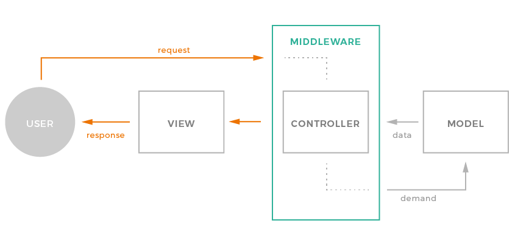
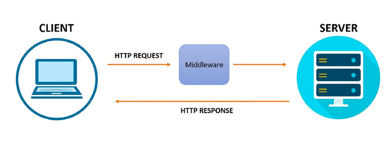
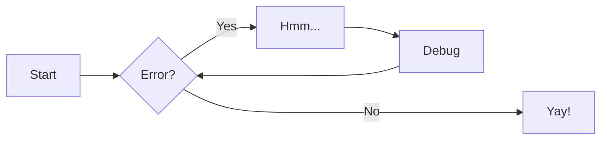

# Konsep Middleware

Middleware di Laravel menyediakan mekanisme yang praktis untuk memfilter permintaan HTTP yang masuk ke aplikasi Anda. Middleware ini bertindak sebagai jembatan antara permintaan dan respons — sempurna untuk autentikasi, pencatatan log, validasi input, atau pembatasan akses.



Pastikan middleware tetap fokus dan dapat digunakan kembali. Untuk logika yang kompleks (misalnya, beberapa peran, izin, atau pencatatan), buat kelas middleware terpisah atau gunakan mekanisme kebijakan/gerbang.



Client adalah **pihak yang meminta layanan atau data**. Server adalah **pihak yang menyediakan layanan atau data yang diminta oleh client**.

<br />



Lorem ipsum[^1] dolor sit amet, consectetur adipiscing elit.[^2]

!!! note

    Lorem ipsum dolor sit amet, consectetur adipiscing elit. Nulla et euismod
    nulla. Curabitur feugiat, tortor non consequat finibus, justo purus auctor
    massa, nec semper lorem quam in massa.

```bash title="bash" linenums="1" hl_lines="2"
~$ php artisan make:middleware CheckUserRole
~$ php --version
```

[^1]: Lorem ipsum dolor sit amet, consectetur adipiscing elit.
[^2]:
    Lorem ipsum dolor sit amet, consectetur adipiscing elit. Nulla et euismod
    nulla. Curabitur feugiat, tortor non consequat finibus, justo purus auctor
    massa, nec semper lorem quam in massa.